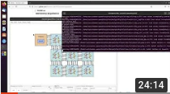

**Author**: Marcelo Ruaro, Kevin Martin
# Credits
This many-core project is based on OpenPiton, an open-source many-core platform developed by Princeton University. We use OpenPiton as starting point to do our modifications. Please don't forget to cite OpenPiton properly if you use the many-core herein provided.


[Link to OpenPiton's original project](https://github.com/PrincetonUniversity/openpiton)


# Tutorial Installation OpenPiton - Lab-STICC on Ubuntu 20.04

### Video: Step-by-step Installation from a Fresh Installation of Ubuntu 20: 
[](https://youtu.be/mmB-RKY-_Js)

## Prerequisites
* Install packages:
  ```c
  sudo apt-get install git python gcc-7 g++-7 gperf autoconf automake autotools-dev libmpc-dev libmpfr-dev libgmp-dev gawk build-essential bison flex texinfo python-pexpect libusb-1.0-0-dev default-jdk zlib1g-dev valgrind csh device-tree-compiler libcanberra-gtk-module libcanberra-gtk3-module
    ```
* Prepare your terminal
  * Edit your terminal to "Run a custom command instead of my shell" (search this entire sentence in google):
  * Check the marker "Run a custom command instead of my shell"
  * Add the following custom command in the text field:
    ```c
    bash --login
    ```
  * Restart your terminal
  

## Clone Nooman-OpenPiton from GitHub
* Clone Nooman OpenPiton from Nooman-Lab-STICC git:
   ```c
    git clone https://github.com/Nooman-LabSTICC/nooman-openpiton.git
   ```

## Set Nooman-OpenPiton environment variables

  * Add the following text at the end of your **~/.bashrc**: 
  ```
    #OPEN_PITON_ARIANE  
    export PITON_ROOT=/home/USER/ROOT_PATH_OF_OPENPITON  
    export PATH=${PITON_ROOT}/bin:${PATH}  
    cd $PITON_ROOT; source $PITON_ROOT/piton/ariane_setup.sh; cd -   
  ```

* Close and open your terminal again.
  
## RISC-V Toolchain Installation
* Go to $PITON_ROOT:
    ```c
    cd $PITON_ROOT
    ```
* Install risc-v toolchain:
    ```c
    ./piton/design/chip/tile/ariane/ci/build-riscv-gcc.sh
    ```
    * Wait the installation process. **It takes time (dozen of minutes)**.
    * When finished, this command will install risc-v inside **~/riscv_install** (you can change this path editing the this script)
    * To check if risc-v was installed, type the following command and pres TAB two times. It must show all extensions of the toolchain.
      ```c
      riscv64-unknown-elf-  (press 2x TAB key)
      ```

## Verilator Installation
* Go to $PITON_ROOT:
    ```c
    cd $PITON_ROOT
    ```
* Install Verilator:
    ```c
    ./piton/design/chip/tile/ariane/ci/install-verilator.sh
    ```
* Wait.
## QuestaSim
* Install QuestaSim following the own tool instructions
* Make sure that the command **vsim** is running/working from your terminal
  * After installation, just type **vsim** and QuestaSim must open.

<br/><br/>

Command *openpiton* (used to run and debug testcases)
============
Edited: 11.Oct.2021, by Marcelo Ruaro

The **openpiton** command abstracts significantly the OpenPiton generation, execution, and debugging process.


Mandatory arguments
---------------
* *X_DIMMENSION*: 1st argument is an integer positive number representing the number of cores at X dimension
* *Y_DIMMENSION*:  2nd argument is an integer positive number representing the number of cores at Y dimension
  


Optional arguments (-run or -gen or -all is mandatory):


* **-gen**: Generates the manycore model according to the XY dimension
  * Ex: ``` openpiton 2 1 -gen ```
* **-run**: Runs the manycore model in the specified testcase. Requires a testcase name
  * Ex: ```openpiton 2 1 -run prod_cons```
* **-all**: Generates and runs the manycore model in the specif testcase. Requires a testcase name
  * Ex: ```openpiton 2 1 -all prod_cons```
* **-vsim**: Opens the questasim. Must be used with *-run* or *-all* commands.
  * Ex: ```openpiton 2 1 -run prod_cons -vsim```
* **-wave**: Generate the wave.do to be loaded in questasim. Must be used with the *-run* or *-all* commands.
  * Ex: ```openpiton 2 1 -run prod_cons -vsim -wave```
* **-debug**: Open the graphical debugger. Must be used with the *-run* or *-all* commands.
  *  Ex.1: ```openpiton 2 1 -run prod_cons -vsim -wave -debug```
  *  Ex.1: ```openpiton 2 1 -run prod_cons -debug```
*  **-V**: Uses Verilator to compile and simulate the many-core
*  **-Q**: Uses QuestaSim (by default) to compile and simulate the many-core
*  **openpiton-debugger**: you can use the command **openpiton-debugger** *<plath_of_file_plaform.cfg>* to open just the ManyGUI tool in a previous simulated testcase. As argument, this command requires the path to the platform.cfg file. This file can be found at *build/debug/plataform.cfg*. Usually after simulating a testcase we will copy the *build/debug/* directory to a safe place in order to store the simulation data usefull to debugging. This command is usefully to debug this standalone testcase using the ManyGUI.
---------------


## Running an example
* Go to $PITON_ROOT/build:
    ```c
    cd $PITON_ROOT/build
    ```
* Run the following command:
    ```c
    openpiton 3 3 -V -all syn_parallel_9cores -debug
    ```

--------------
This project was developed in Lab-STICC - UBS, Lorient, France.
Contact:
> kevin.martin@univ-ubs.fr (Kevin Martin)
